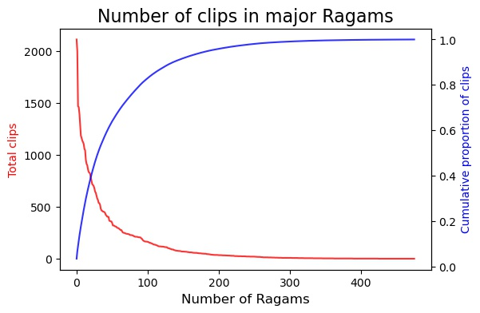

# IsAI
Web app that predicts the ragam of a given carnatic audio clip

## Introduction/Business Objective
Carnatic music is a south Indian classical form of music. What distinguishes it from other forms of Western music is the absence of discrete notes.
This allows the genre to have a rich grammatical framework. One of the aspects of this grammatical framework of the melody is the Ragam.
The structure of a Ragam is similar to the structure of a language. Just as how words form the vocabulary of a language, melodic phrases form the vocabulary of a Ragam.
As one can imagine, learning and assimilating the vocabulary of the various Ragams that exist would take many years.

This app is a solution to help users identify the Ragam of any clip. A user can upload an audio clip to the app and this will be passed through the Machine Learning model that has been trained to 
identify the Ragam of the clip. It will then return the predicted Ragam of that clip and give suggestions of other songs the user can listen to along with links to the same.

## Usage
You can find the app in http://isaiapp.herokuapp.com/
Upload an audio file (.wav) with a size smaller than 5 MB. You can replay the clip that has been uploaded. The app will now give suggestions of other clips from the predicted Ragam and links to the same.

## Project description

### Data ingestion 
The online library Sangeethapriya.org was used as the source of data for training the ML models. 
Sangeethapriya contains over 60,000 audio files which correspond to over 2TB of data. There are about 450 Ragams in the database with close to 3000 distinct compositions from about 800 artists.
The class spScraper in data_utils/data_utils.py scrapes all the metadata of the files in the database.
The class urlScraper in data_utils/data_utils.py scrapes the album hyperlinks and the download links of each of these files in the database.
The class downloader in data_utils/data_utils.py downloads the files requested from the database and saves to disk.

### Feature engineering 
Knowing that the melodic phrases are what uniquely signify a ragam, the right way to obtain features is to obtain time series data of the average pitch/frequency as a function of time.
The right feature in this case is the chromagram which takes a short time Fourier transform and bins the dominant frequency in the spectrum into the respective bins. These dominant frequencies for each short time interval are then plotted as a function of time to give the chromagram.
The chromagram is obtained using librosa and is visualized using bokeh in app.py.

In order to obtain a minimal viable product, the features used are instead the following
- The mean Mel Frequency Cepstral Coefficients (MFCCs) for a duration of 20 seconds.
- The mean Chroma features for a duration of 20 seconds.
- The mean values of the Mel Spectrogram for a duration of 20 seconds.
- The mean contrast for a duration of 20 seconds.
- The mean tonnetz for a duration of 20 seconds.

All these together give 193 features which can then be fed into classifiers.

The feature engineering process is done from the file ml/get_features.py

### Machine Learning 
The 193 features obtained in the above feature engineering process are then fed into a couple of classification algorithms - the Random Forest Classifier and the Ridge Classifier. 
A subset of the audio files from the database were downloaded to disk - 50 files from 130 distinct Ragams totalling upto 6500 files. This made sure that there were no imbalanced classes.

The number 130 was obtained from the following plot. One can see that a very large proportion of the songs in the database are from the top 130 ragams. 

In order to train the ML model, the files were split into test and train with a test_size of 20 percent. 

With the training data, the features were extracted and then run into a Random Forest classifier and a Ridge classifier. 
For the MVP, the trained RF classifier was able to predict the ragam of a subset of the audio clips containing only 10 ragams. 
In the training set the accuracy score was 68% and on the test set the accuracy score was 72%. Before obtaining these scores, a cross-validation was done to ensure that the model did not overfit.

This is done in ml/model.py. 

